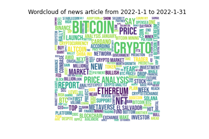

# Milestone 1: Cryptogram

## Dataset

In the project, we use the data source *cryptocompare* [1](https://www.cryptocompare.com/), which provides various information related to crypto-currency and several free APIs to access the data. The main reason of using this data source is its high quality: most **numeric** data are cleaned and there is no need to pre-process the dataset for data like price. They also provide daily **news** data which
our text analysis are based on.

The detail of our source data is as follows:

- **Price data** contains the daily price data for 30 different cryptocurrencies traded in 6 different currencies, including features *high, low, open, volumefrom, volumeto,
annd close*, for major crypto-currencies from 2010 to 2022.
- **News data** contains the up-to-date news article information, including *date,
title, body, and image*, from 2013 to 2022. We aggregate the articles by time and by
coin.

You may find our raw data and cleaned data in [raw_data](../raw_data/) and [cleaned_data](../cleaned_data/).
The scripts for data cleaning and pre-processing are in [scripts](../scripts/).

## Problematic

Digitised assets and innovative financial channels are emerging in recent years. The tendency
of the number of financial institutions to include cryptocurrencies in their portfolios has
accelerated [2](https://jfin-swufe.springeropen.com/articles/10.1186/s40854-021-00321-6). Although many traders and scholars want to know more in this area, the websites online only contain the information of the price, there lacks an in-dept analysis. Our website aims to bridge this gap by including related news information. We hope an intuitive visualization together with updated new could give a better guidance to novices in this field.

The web application we plan to build is called **_Cryptogram_**. It will visualize:
- Useful price information about cryptocurrency
- Filter informative news related to certain cryptocurrency
- Display related news for price fluctuations
- Enable users to compare different kinds of cryptocurrencies (foundation year, trade volume, ranking in the market etc.)
- Show the correlation of the prices (using Pearson correlation and heatmap)

## Exploratory Data Analysis

### Price

We have 30 different kinds of cryptocurrencies in total, and the trading information of each
of them in 6 different currencies.

For each currency, we have details about *date, highest price, lowest price, open price, close
price, trading volume*. The longest trading history dates back to 2010, we have the newest
data till March in 2022.

In [price-analysis](../scripts/price-analysis.ipynb), we provide the scripts to load and alalysis the price data. More specifically, we calculate the monthly stats of _open, close, difference, and percentage of difference_. The example results include:

Here are some insights:

1. Most successful crypto-currencies experience high increase at the **initial** release.
2. Most successful crypto-currencies have certain months with **dramatic** increase, when their news is valuable to discover.
3. Except the certain months with dramatic increase, most prices have limited fluctuation.

### News

The API contains news articles from 2013 to 2022 with 28 categories. 

#### Number of news article

| Year | # of news article | per day |
| ---- | ------| ---- |
| 2013 | 28    |≈ 0|
| 2014 | 1     |≈ 0|
| 2015 | 0     |0  |
| 2016 | 20    |≈ 0|
| 2017 | 5002  | 14|
| 2018 | 18238 | 50|
| 2019 | 18250 | 50|
| 2020 | 18300 | 50|
| 2021 | 18250 | 50|
| 2022 | 4700  | 50|

From year 2018 to 2022, there are  approximately 50 articles per day. However there are lack of articles data from 2013 to 2016, which does not have even 1 news article per day in average.

Each news article are categorized among 28 different categories such as type of cryptcurrency like 'BTC', 'BCH', 'ETH', or common news category related with economy like 'Trading', 'Technology', Asia'. An article can have multiple category.

For all of the news article, the most popular category overall is 'BTC' which is Bitcoin. Categories such as 'Trading', 'Market' are also popular. 

We also analyzed 15 categories which its name is the type of coins. We can assume the people are interested in BTC, ETH compared with other cryptocurrencies. 

Please see [News Basic Statistics](../scripts/news-basic-statistics.ipynb) for the above data analysis.

#### Keyword of news article
We extracted the most common keyword from the body paragraph article for certain timeperiod.

For example, the above image is the word cloud that contains all of the body text at January and February 2022, respectively. We removed common stop word, special symbols, and numbers.

You can see that there are too obvious keywords such as Bitoin, Crypto, Ethereum. We will manually remove such meaningless keywords and try to extract meaningful keywords that could be distinguishable among different days. The below images are the wordcloud result of January and February 2022, respectively, after removing obvious keywords 'bitcoin', 'crypto', 'ethereum', 'price'.

Please see [News Keyword Analysis](../scripts/news-keyword-analysis.ipynb) for the above data analysis.

## Related Works

There are other websites showing crypto-currency data, but we are the first one to **integrate**
the **numerical** and **text** data visualization with **corelation analysis**.

- Coin360([https://coin360.com/](https://coin360.com/)) : A website with nice numerical data visualization on crypto-currencies. Users can easily get the latest price and capacity values. However, it does not integrate the news data for analysis.

- CoinDesk([https://www.coindesk.com/](https://www.coindesk.com/)) : A website focusing on crypto-currency news.
It provides articles all about crypto-currencies. However, it does not have further text analysis and interaction between the price and the news.

- BitNodes([https://bitnodes.io/](https://bitnodes.io/)) : A website visualizing the estimated distribution of BitCoin nodes in the world. However, it does not provide information for other crypto-currencies and the method may not apply to others.

- TxStreet([https://txstreet.com/v/eth-btc](https://txstreet.com/v/eth-btc)) : A website displaying information of decentralized Apps with interesting visualization and interface. However, it does not fit
into our main purpose.

## References

1. *Cryptocompare*: [https://www.cryptocompare.com/](https://www.cryptocompare.com/)
2. Fan Fang et al. *Cryptocurrency trading: a comprehensive survey*. In: Financial Innovation 8.1 (2022),
pp. 1–59.
